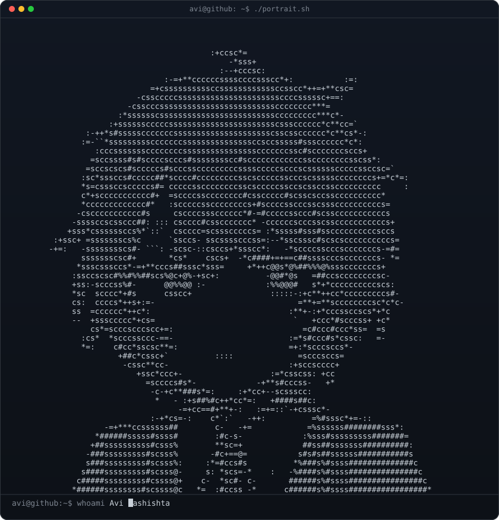

<table>

<tr>

<td valign="top"></td>

<td valign="top"></td>

</tr>

</table>

\## Arya Saputra Nugraha

\*\*DevSecOps · Software Engineer · Security Engineer\*\*

\[!\[Instagram](https://img.shields.io/badge/Instagram-justryasa\_\_-E4405F?style=for-the-badge\&logo=instagram\&logoColor=white)](https://www.instagram.com/justryasa\_/)

 

<!-- animated contribution graph, refreshed daily by the workflow -->

